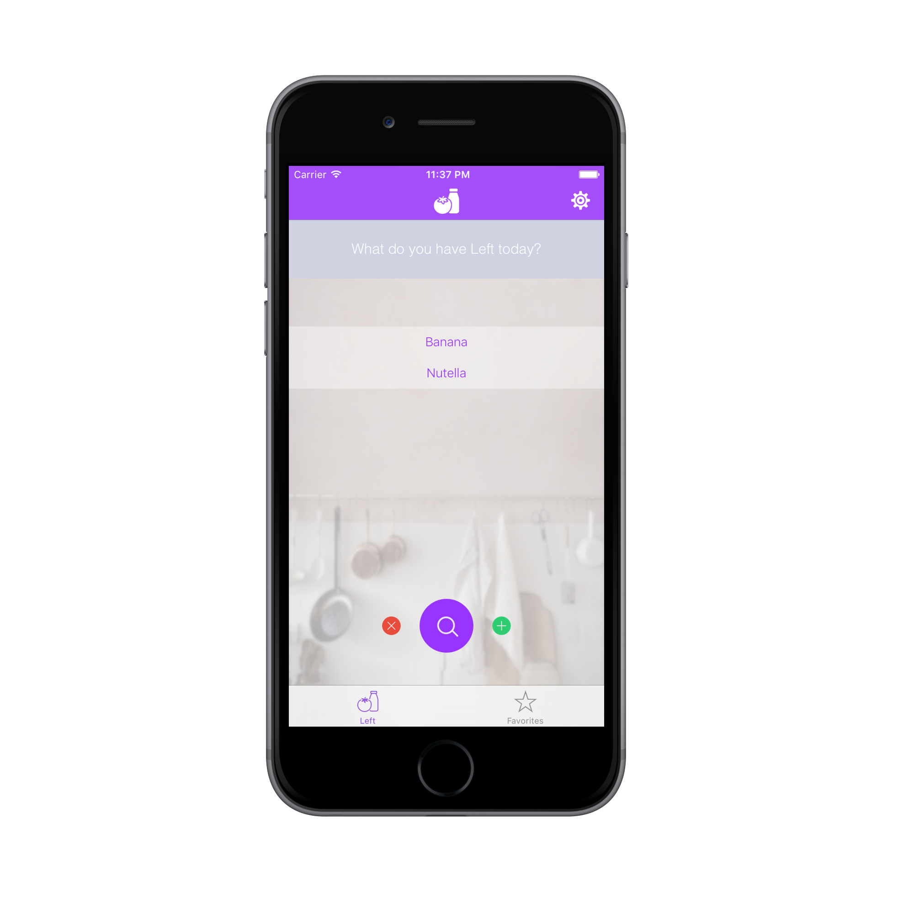
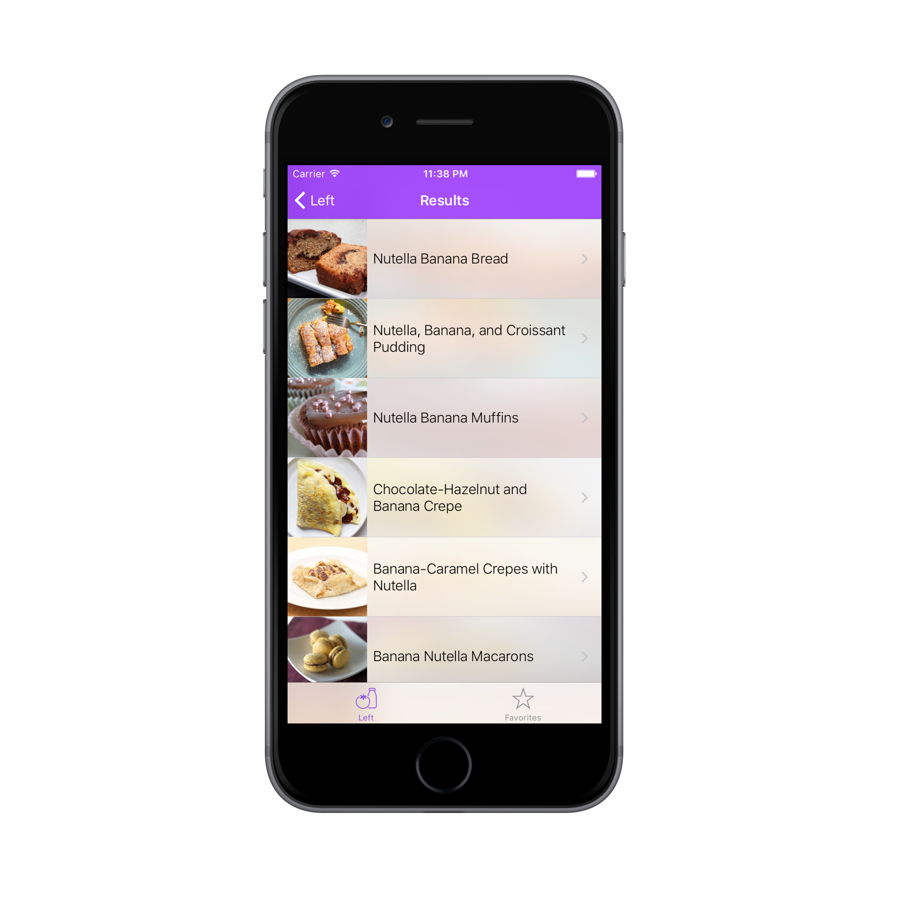

# Left
Left is an iOS app that lets you search for recipes that use the ingredients you have "left." Simply input up to 5 ingredients and press 
"Search" to see results. Find it on the App Store [here!](https://appsto.re/us/QIpFcb.i)

#HTTP Requests
HTTP requests are handled using the [Alamofire](https://github.com/Alamofire/Alamofire) library.

#JSON Parsing
To parse the information obtained from the requests, I used the [SwiftyJSON](https://github.com/SwiftyJSON/SwiftyJSON) library.

#Recipe Information
All the results shown in this app are obtained using the [Food2Fork](https://food2fork.com) recipe search API.

